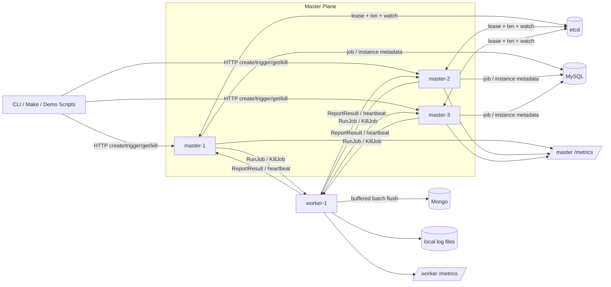

# DJS

Distributed Job Scheduler. The project targets the core concerns of a small scheduling infrastructure service rather than a toy cron runner: multi-master leader election, worker discovery, at-least-once execution, retry and timeout recovery, forced kill, batched log ingestion, and Prometheus-style observability.

## Quick Start

Requirements:
- Docker / Docker Compose
- Go 1.24+
- Bash

One-command workflow:

```bash
make up
make health
make demo
make test
make down
```

What each target does:
- `make up`: starts MySQL, Mongo, etcd, 3 masters, 1 worker; applies `schema.sql`; waits for leader election and health endpoints.
- `make health`: prints cluster health, elected leader, worker state, and metrics endpoint readiness.
- `make demo`: runs a 2-3 minute interview demo script covering create job, dispatch, kill, and leader failover.
- `make demo-failover`: only runs the leader-switch fault drill.
- `make test`: runs `go test ./...` and the live milestone 8 verification script.
- `make down`: stops the compose stack.

If you want to present the demo step by step instead of letting it run through:

```bash
DEMO_PAUSE=1 make demo
```

## Architecture



Default demo deployment:
- 3 masters, only 1 leader schedules at any moment
- 1 worker in compose, but worker registration / round-robin selection already supports more
- MySQL stores jobs and job instances
- Mongo stores batched execution logs
- etcd stores worker registrations and the leader lease key

## 2-3 Minute Demo

`make demo` runs the full script in [`scripts/demo.sh`](/home/nemo/projects/DJS/scripts/demo.sh):

1. Cluster health summary
2. Create a manual job and trigger it
3. Show the instance reaches `SUCCESS` and display the worker-side log tail
4. Create a long-running job, show it in `RUNNING`, then kill it
5. Show the instance reaches `KILLED` and display `SIGTERM -> SIGKILL`
6. Create a cron job, stop the current leader, wait for a new leader, and show cron execution continues
7. Restart the old leader and disable the demo cron job

For a focused fault drill:

```bash
make demo-failover
```

## Interview Talk Track

If you need to explain the system in 2-3 minutes, this is the shortest defensible path:

1. Jobs are created through the master HTTP API and persisted in MySQL.
2. Three masters run simultaneously, but etcd lease + transaction election ensures only one leader schedules.
3. Workers self-register into etcd; the leader discovers them and dispatches work over gRPC.
4. Execution is at-least-once: the master retries on dispatch failure, worker loss, or heartbeat timeout; stale attempts are ignored.
5. Worker logs are written both to local files and to a buffered Mongo batcher so high-frequency jobs do not turn log writes into the bottleneck.
6. Prometheus metrics expose success rate, latency, retry counts, queue depth/high-water marks, worker log queue pressure, and leader switch count.
7. The demo shows both the happy path and a real fault drill: force-kill a task, then kill the leader and watch the new leader continue scheduling.

## Key Design Choices

### Why at-least-once instead of exactly-once

Exactly-once across distributed scheduling, worker crashes, and network failures is expensive and usually leaks complexity into the whole stack. This project chooses:

- master-owned retries and timeout recovery
- worker-side idempotency by `instance_id`
- stale attempt rejection on `ReportResult`

That gives a practical, debuggable at-least-once model that is common in real infrastructure systems.

### Why only the leader schedules

All masters stay hot, but only the elected leader runs the scheduler loop. This avoids duplicate cron triggering while still keeping failover fast. When the leader changes, the new leader:

- resumes scheduling
- catches up missed cron slots inside a bounded window
- keeps duplicate creation under control through `job_id + scheduled_at` uniqueness

### Why worker logs go to local file first, Mongo second

Direct synchronous DB logging would turn noisy jobs into a storage bottleneck. The worker therefore:

- always writes instance logs to local files for immediate forensic access
- pushes log lines into a buffered channel
- flushes them to Mongo by batch size or time window
- exports queue depth, flush counts, dropped count, and Mongo availability metrics

This means log persistence is observable and pressure can be explained during load tests.

### Why queue metrics are event-driven and reconciled

A pure polling gauge can miss short spikes. A pure in-memory gauge can drift if code paths change. The current design combines both:

- event-driven updates at `PENDING/RUNNING/terminal` transitions
- periodic DB reconciliation as a safety net

That keeps queue high-water marks useful during demos and pressure tests.

## Useful Endpoints

- Master health: `http://127.0.0.1:8080/healthz`, `8081`, `8082`
- Master metrics: `http://127.0.0.1:8080/metrics`, `8081`, `8082`
- Worker health: `http://127.0.0.1:8083/healthz`
- Worker metrics: `http://127.0.0.1:8083/metrics`

## Repo Map

- [`cmd/master/main.go`](/home/nemo/projects/DJS/cmd/master/main.go): master HTTP/gRPC API, scheduling, retries, leader reaction
- [`cmd/worker/main.go`](/home/nemo/projects/DJS/cmd/worker/main.go): worker execution, heartbeat, kill handling
- [`cmd/master/metrics.go`](/home/nemo/projects/DJS/cmd/master/metrics.go): master metrics and queue depth accounting
- [`cmd/worker/log_batcher.go`](/home/nemo/projects/DJS/cmd/worker/log_batcher.go): buffered Mongo log batcher
- [`internal/election/election.go`](/home/nemo/projects/DJS/internal/election/election.go): etcd leader election helper
- [`internal/discovery/discovery.go`](/home/nemo/projects/DJS/internal/discovery/discovery.go): etcd worker registration and discovery
- [`scripts/demo.sh`](/home/nemo/projects/DJS/scripts/demo.sh): full demo and failover drill
- [`scripts/verify_milestone8.sh`](/home/nemo/projects/DJS/scripts/verify_milestone8.sh): high-frequency logging and observability verification

## Notes

- `make up` is idempotent and will re-apply schema upgrades.
- `make demo` leaves the cluster running when it finishes.
- The demo compose file currently uses one worker to keep the interview setup compact; the discovery path already supports multiple workers.
